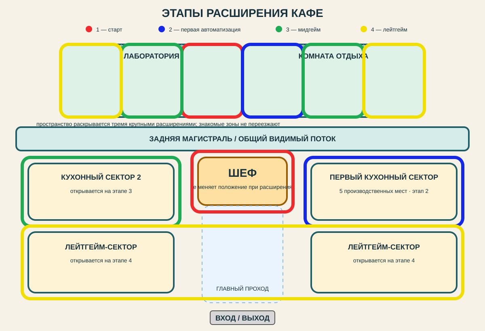
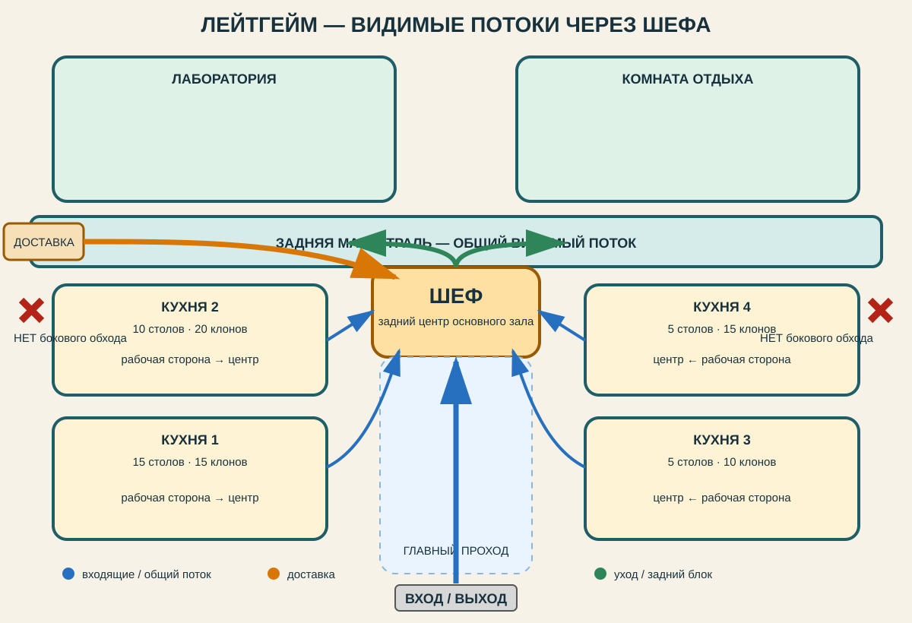

# Slapdash Cafe — отложенная лейтгейм-планировка кафе

**Статус:** концепция зафиксирована для будущей переработки пространства. **Сейчас не реализовывать.**

Связанные документы: [FULL_GAME_ROADMAP.md](FULL_GAME_ROADMAP.md), [CAMPAIGN.md](CAMPAIGN.md), [STAFF_LOUNGE.md](STAFF_LOUNGE.md), [LABORATORY_AND_RECIPE_BOOK.md](LABORATORY_AND_RECIPE_BOOK.md).

## Решение

В поздней стадии кафе должно ощущаться как одна большая работающая машина, которую Шеф физически наблюдает из центральной точки, а не как набор изолированных комнат с удобными невидимыми маршрутами.

Шеф размещается **у задней границы основного зала**, примерно по центру стены между производственным залом и задним блоком лаборатории/комнаты отдыха. Это постоянная смысловая точка пространства: от входа к нему ведёт главный центральный проход, а кухни раскрываются рабочими сторонами внутрь, в сторону общего зала и Шефа.

Главное намеренное ограничение — **не делать боковые обходные служебные коридоры**, позволяющие доставке или сотрудникам незаметно попадать прямо к кухням. Путь может быть чуть менее «идеальным» логистически, зато игрок постоянно видит, как кафе живёт: коробки несут мимо Шефа, люди расходятся по кухням, клоны идут на обучение и после смены возвращаются в задний блок.

## Что обязательно сохранить при будущей реализации

- **Шеф — задний центр зала.** Не прятать его в отдельную комнату и не уводить к боковой стене.
- **Кухни смотрят внутрь.** Рабочие стороны и движение сотрудников должны быть читаемы из центрального пространства.
- **Главный проход — через поле зрения Шефа.** Вход/выход остаётся снизу, движение идёт к центру и дальше расходится по производственным зонам.
- **Нет удобных боковых шорткатов.** Боковая дверь приёмки допустима, но после неё груз должен попадать в общий видимый маршрут, а не в скрытую сеть коридоров до конкретной кухни.
- **Лаборатория и комната отдыха — в заднем блоке.** Они остаются отдельными помещениями, их двери подключены к той же читаемой магистрали, а сами помещения примыкают друг к другу через одну общую стену без бесполезного центрального зазора.
- **Расширение не двигает Шефа.** Новые кухонные сектора добавляются в стороны/глубину вокруг центрального каркаса, не разрушая наблюдаемость потоков.

## Этапы раскрытия пространства — принятое решение

Кафе имеет **четыре физически различимых состояния здания: стартовое состояние + три крупных расширения**. Расширения нужны не как регулярная покупка дополнительных метров, а как переход между этапами игры: ручная работа → первая автоматизация → развитая автоматизация → лейтгейм-масштаб.

| Состояние | Цвет на схеме | Что открыто | Смысл этапа |
|---|---|---|---|
| **1. Старт** | красный | Шеф-зона + примерно треть лаборатории | Ручная работа Шефа и раннее знакомство с лабораторией/клонированием. Производственного сектора для клонов ещё нет. |
| **2. Первое расширение** | синий | Первый кухонный сектор на **5 производственных мест** + стартовая часть комнаты отдыха | Переход к автоматизации: появляется первая небольшая бригада, а вместе с ней цикл «клон → работа → отдых». |
| **3. Второе расширение** | зелёный | Ещё один кухонный сектор + следующая часть лаборатории + следующая часть комнаты отдыха | Мидгейм и развитие автоматизации: игрок организует уже не отдельного клона, а несколько производственных групп и инфраструктуру под них. |
| **4. Третье расширение / лейтгейм** | жёлтый | Все оставшиеся кухонные сектора + лаборатория и комната отдыха до полного размера | Кафе превращается в большую работающую систему с массовыми потоками сотрудников, обучением, доставкой и крупным производством. |

### Debug-прототип для оценки масштаба

Для быстрой проверки пропорций и ощущения пространства есть отдельная сцена:

`res://scenes/debug/cafe_layout_debug.tscn`

Её можно открыть в Godot и запустить как текущую сцену через **F6**. Это изолированный blockout: он не заменяет основную сцену кафе и не подключён к обычному прохождению.

В сцене:
- кнопки **«1 · Красный» → «4 · Жёлтый»** последовательно показывают накопительные состояния здания;
- клавиши **1–4** делают то же самое во время бега;
- **WASD** — движение, **Shift** — бег, **Space** — прыжок, мышь — обзор;
- **Tab** переключает между FPS-обзором и свободным курсором для нажатия UI;
- каждое состояние собрано как отдельный цельный snapshot: внутри открытого контура есть непрерывный пол, а наружные стены автоматически идут по его текущему периметру;
- визуальный пол больше не собран из пересекающихся тонких BoxMesh-слоёв: цветные зоны лежат как одинарные плитки без наложения, разметка проходов перенесена в объёмные указатели; это устраняет z-fighting/мерцание почти совпадающих поверхностей;
- рабочее место Шефа открыто сзади в общую заднюю магистраль — отдельной стены непосредственно за столом нет;
- кухни раскрываются рабочими сторонами к центральному пространству, включая оба лейтгейм-сектора;
- граница с **будущей** частью здания отличается от настоящей наружной стены: вместо прозрачности используется глухая временная строительная перегородка — тёплые панели/фанера в тёмной металлической раме, жёлтая предупреждающая полоса и надпись **«РАСШИРЕНИЕ»**. Это целевой визуальный приём и для будущей игровой версии: игрок понимает, что пространство продолжится здесь, но не видит пустой debug-мир за стеной;
- когда соответствующее расширение покупается, временная перегородка исчезает, а на её месте становится обычный открытый проход; в финальном жёлтом состоянии таких перегородок уже нет;
- снаружи есть общий грунт и входная дорожка, поэтому из здания можно выйти без падения в пустоту;
- при переходе на меньший этап игрок автоматически возвращается ко входу, если оказался в ещё не открытой части; **R** делает то же вручную;
- полный лейтгейм-blockout занимает примерно **40 × 36 м**.

### Правила расширений

- **Шеф не переезжает.** Его рабочая зона остаётся тем же пространственным якорем от начала игры до лейтгейма; кафе физически разрастается вокруг неё.
- **Расширения открываются крупными смысловыми кусками.** Каждое из трёх расширений должно заметно менять ощущение от кафе и поддерживать новый этап геймплея, а не быть небольшим приростом площади.
- **Уже открытая геометрия сохраняется.** Следующий этап добавляет новые сектора вокруг существующего каркаса, не перестраивая знакомое игроку пространство.
- **Рост бэкэнда идёт вместе с производством.** Лаборатория и комната отдыха расширяются параллельно росту числа клонов, чтобы инфраструктура ощущалась частью той же прогрессии.
- **Финальное состояние совпадает с принятой лейтгейм-композицией ниже.** Принцип видимых потоков через Шефа, отсутствие скрытых боковых обходов и ориентация кухонь внутрь действуют на всех этапах, где соответствующие зоны уже открыты.
- Конкретные цены, требования по звёздам и точный момент покупки каждого расширения относятся к будущей балансировке. Сейчас зафиксированы **геометрия этапов и их игровая роль**.

## Потоки

| Поток | Базовый маршрут |
|---|---|
| Доставка | Приёмка → задняя/центральная магистраль → зона рядом с Шефом → нужная кухня |
| Входящие сотрудники и посетители | Главный вход → центральный проход → видимая зона Шефа → нужный сектор |
| Обучение и мастер-классы | Кухня/сотрудник → центральная зона у Шефа → место обучения → обратно через тот же общий поток |
| Вечерний уход клонов | Кухни → проход рядом с Шефом → задний блок / комната отдыха |
| Перемещение между лабораторией и производством | Лаборатория → задняя магистраль → зона Шефа → кухня |

Не требуется, чтобы каждый маршрут проходил буквально в метре от стойки Шефа. Требование про **визуальную читаемость**: из его зоны и из центрального зала должна быть видна основная масса перемещений, без скрытого параллельного коридора.

## Масштаб референса

Зафиксированный эскиз показывает лейтгейм примерно на **35 рабочих столов и 60 сотрудников/клонов**:

| Сектор | Столы | Клоны |
|---|---:|---:|
| Кухня 1 | 15 | 15 |
| Кухня 2 | 10 | 20 |
| Кухня 3 | 5 | 10 |
| Кухня 4 | 5 | 15 |
| **Итого** | **35** | **60** |

Числа нужны для проверки масштаба помещения, плотности и обзорности. Они **не замораживают баланс**, цены, предел сотрудников или финальный состав кухонь.

## Схема потоков

Схема фиксирует геометрию и направление потоков, а не точные метры, размеры мебели или pathfinding.

## Референсный эскиз

Это принятый концептуальный эскиз. Он нужен как визуальный ориентир композиции; отдельные декоративные детали и пропорции не считаются финальным артом.

## Что сейчас не делать

Не менять ради этого решения `scenes`, навигацию, navmesh/pathfinding, точки спавна доставки, поведение клиентов/клонов, лабораторию или комнату отдыха. Не начинать перестройку текущего кафе частями.

Эта запись существует именно затем, чтобы идею не потерять и вернуться к ней отдельным этапом после более приоритетных задач кампании.

## Критерии будущей реализации

Будущая версия считается соответствующей этому решению, если одновременно выполняются четыре условия:

1. Шеф остаётся в заднем центре основного зала и видит центральную производственную зону.
2. Рабочие кухни визуально обращены к центру, а не «спиной» к нему.
3. У доставки и сотрудников нет скрытого бокового маршрута, который полностью минует центральный зал.
4. Основные дневные и вечерние потоки естественно создают движение рядом с Шефом и остаются читаемыми при расширении кафе.

## Уточнение debug-макета: зоны A–D

Текущий прототип сохраняет фиксированного Шефа и четыре накопительных этапа. Внутри каждой производственной зоны находятся посетители; столы окружают их, а повара стоят с внешней стороны. Золотой край стола обозначает подачу посетителю, голубая отметка — место повара. Это условные слоты со столами, без назначения конкретного типа кухни.

- Этап 1: центральная площадка Шефа, подход шириной 8 м и первая часть лаборатории 6 × 6 м. Доступная площадь пола — 324 м² вместо 444 м².
- Этап 2: Zone A — пять столов кривой подковой, раскрытой к Шефу; первая часть отдыха.
- Этап 3: Zone B — семь столов вытянутым неровным овалом; расширение лаборатории и отдыха.
- Этап 4: Zone C — восемь столов по краям угловатой площади; Zone D — десять столов вокруг двух соединённых посетительских карманов; последние части задних помещений.

Столы имеют условный габарит 2 × 1,1 м. Расстановка фиксирована и асимметрична. Общий контур 40 × 36 м; глубина задних комнат 6 м, задний проход 4 м. Возле Шефа остаётся более широкая площадка. Боковых скрытых служебных коридоров нет.

30 столов в этом макете — предварительная композиция, а не новый лимит или баланс. Старый ориентир 35 столов / 60 сотрудников выше сохраняется как ориентир масштаба; актуальная форма зон определяется debug-сценой. Исходные SVG иллюстрируют порядок расширений, а не новую расстановку столов. Навигация, посетители и игровые системы здесь пока не моделируются.
