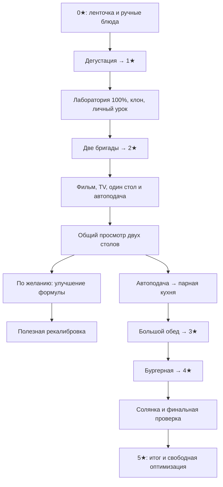

# P5 — граф развития и завершение кампании (проверено в P5.07)

База итоговой проверки: `fdc38865a247eda9783216fc5861f073cdeb8df9` (main после P5.06). Исходная спецификация P5.04: `166b950cfb72c08e983bddb9f03437165ce58bdf`. Движок: Godot `4.7.2.stable.official.ed1daf0bf`.

## Граница результата

Основной путь реализован в P5.01–P5.04, каталоги — в P5.05, личные объяснения — в P5.06. `P5_CATALOG_RULES.json` описывает действующие правила: 52 товара, 16 наборов, 4 расширения помещений и технические бесплатные инструменты. Сам JSON не исполняется игрой. P5.07 проверяет весь путь с оплатой покупок; экономика, ограничения прогона и человеческий плейтест описаны в [P5_07_BALANCE_REVIEW.md](P5_07_BALANCE_REVIEW.md).

Канонические слои: `ProgressionDirector` хранит подтверждённые факты и монотонные открытия; `FeatureCatalog` описывает их зависимости; `FeatureAccess` проверяет показ и возможность команды. `CafeJourney` выбирает одну текущую цель. Отметки «Новое» и объяснения не предоставляют и не задерживают доступ. Источником истины остаётся хост.

## Основной граф

### Точные открытия основного пути

Все перечисленные требования соединены AND. Открытие сохраняется после снижения денег, изменения состава или временной занятости. Наличие feature само по себе не заменяет установку нужного оснащения.

| Feature | Мин. ★ | Предметные feature-зависимости | Подтверждённые условия |
|---|---:|---|---|
| `dish_sausage` | 0 | — | Доступна с начала; первые sauce/plates/rag уже на шеф-стойке |
| `dish_potato` | 0 | — | `first_sausage_served` |
| `dish_wine` | 0 | — | `first_potato_served` |
| `clone_lab` | 1 | `shop_basic` | `first_star_earned` |
| `clone_growth` | 1 | `clone_lab` | `lab_assembled` (`lab_stage >= 3`) |
| `staff_roster` | 1 | `clone_growth` | `first_clone_created` |
| `production_tables` | 1 | `clone_growth` | `first_clone_created` |
| `live_training` | 1 | `production_tables` | `first_clone_created`; для команды нужен конкретный свободный ученик |
| `rest_basics` | 1 | `staff_roster` | `first_clone_created`; диван уже установлен |
| `decor_basic` | 1 | `stars` | `first_auto_served` |
| `video_recording` | 2 | `live_training` | `first_live_lesson_accepted` + `first_auto_served` |
| `video_training` | 2 | `video_recording` | `first_masterclass_saved` |
| `group_training` | 2 | `video_training` | `first_video_training_completed` + `first_video_trained_auto_served` + `two_compatible_stations_seen` |
| `formula_research` | 2 | `clone_lab` | `first_group_training_completed` |
| `formula_upgrades` | 2 | `formula_research` | `first_group_training_completed` |
| `recalibration` | 2 | `formula_upgrades` | `formula_improvement_relevant`; для команды выбранный работник должен быть медленнее формулы |
| `kitchen_pair` | 2 | `production_tables` | `first_group_training_completed` + `first_group_trained_auto_served` |
| `kitchen_specialty` | 3 | `kitchen_pair` | `first_pair_kitchen_auto_served` |
| `kitchen_orchestration` | 4 | `kitchen_specialty` | `first_specialty_kitchen_auto_served` |

После групповой автоподачи основная подсказка ведёт к расширению зала и парной кухне. Формула и кресло не занимают место обязательной цели. Для 3★ покупка кресла и рекалибровка не требуются.

### События, источники и доказательства

| Факт / счётчик | Источник | Что подтверждает; что не считается |
|---|---|---|
| `cafe_opened` | `cafe_inauguration.gd::_host_inaugurate` → доменное событие | Фактическое открытие ленточки; загрузка нового утра не открывает кафе |
| `first_manual_served`, `first_sausage_served`, `first_potato_served`, `first_wine_served` | `cafe_service.gd::_count_completed_customer` | Успешная оплаченная ручная подача; подсказка/попытка приготовления не считается |
| `first_equipment_installed` | `cafe_shop.gd::_install_parcel`, история доставки на станцию 1 | Физическая установка pan/jug/cup/plates/sauce; заказ коробки не равен установке |
| `first_star_earned` | `cafe_service_core.gd::finish_manual`; восстановление по `stars >= 1` | Реальное завершение дегустации |
| `lab_assembled` | `ProgressionDirector.migrate_from_game_state` | `lab_stage >= 3`; базовые части покупаются и устанавливаются последовательно |
| `standard_formula_available` | `cafe_service.gd::_ensure_standard_formula` | При ★≥1 и собранной лаборатории выдаётся 1.0/version 1, только если формулы нет; уже улучшенная не перезаписывается |
| `manual_clone_growth_completed` | `clone_nursery.gd::harvest` → `record_manual_clone_growth` | Успешный цикл с существующим ручным извлечением `automatic == false`; помощь поливом/кормлением допустима; автоматическое извлечение и прямой `create_clone` не считаются |
| `first_manual_clone_growth_completed`, `repeat_manual_clone_growth_completed` | Счётчик выше | Пороги **1 и 2**, независимо от текущей звезды; сохраняются в snapshot |
| `first_clone_created` | `create_clone`, фактические работники/`next_clone_id` | Существование реального клона; не замена счётчика ручных циклов |
| `first_production_station_installed` | Установка производственного стола → `production_station_installed` | Физический стол, не намерение покупки |
| `first_live_lesson_accepted` | `live_training_session.gd`, успешное принятие демонстрации | Навык у конкретного `clone_id`; другой работник не наследует его |
| `first_auto_served` | `cafe_service_core.gd::_count_completed_customer` → `observe_auto_served` | Реально завершённый автоматический заказ, не назначение рецепта |
| `first_staff_rest_completed` | `staff_evening.gd::apply_rest`, текущий `rest_report` | Завершённый отдых с `workers > 0`; покупка мебели не считается |
| `first_masterclass_saved` | Принятый сохранённый мастер-класс | Реальная запись в видеотеке; до 2★ не нужна |
| `first_video_training_completed` | `cafe_service.gd::complete_video_lesson` после фактической выдачи навыков | Полный payload: lesson/record/dish, фактически обученные clone_ids и station_ids; устаревшие участники исключены |
| `first_video_trained_auto_served` | `observe_auto_served` и `_milestone_matches_service` | Автоподача соответствующего блюда от действительно обученного текущего состава и фильма |
| `two_compatible_stations_seen` | `ProgressionDirector._two_compatible_stations` | Не менее двух совместимых целей для существующей записи |
| `first_group_training_completed` | `complete_video_lesson` | Не менее **двух различных столов**, реально получивших навыки в одном просмотре; наличие группы/очереди не считается |
| `first_group_trained_auto_served` | Проверка доказательства общего урока при автоподаче | Хотя бы один обученный в этом сеансе стол выполнил соответствующий заказ |
| `formula_improvement_relevant` | `ProgressionDirector._formula_improvement_relevant` | Есть работник с положительным уникальным id и `tempo < lab_formula_tempo`; учитываются свободные `id` и назначенные `clone_id`; число экспериментов не является условием |
| `first_recalibration_completed` | `clone_recalibrator.gd::begin_return` | Реальный темп работника вырос относительно `state.start` больше чем на 0.00001; открытие/отмена кресла без улучшения не считаются |
| `first_pair_kitchen_auto_served` | `observe_auto_served` для `type_id=kitchen` | Реальная автоподача «Мясо и макароны»; это точное освоение парной кухни |
| `first_specialty_kitchen_auto_served` | `observe_auto_served` для `grill_kitchen` | Реальная автоподача одного из трёх бургеров |
| `first_solyanka_auto_served` | `observe_auto_served` для `solyanka_kitchen` | Реальная автоподача солянки |
| `staff_6_seen`, `staff_9_seen` | **Добавляет P5.05** согласно JSON | Текущий набор положительных уникальных `clone_options().id` достиг 6/9; не число ID, не игроки/фильмы; факт остаётся после уменьшения штата |
| `lounge_expansion_1_completed`, `lounge_expansion_2_completed` | **Добавляет P5.05** согласно JSON | Реальный `lounge_tier >= 1/2`; отдельная покупка мебели не требуется |

Первый факт обучения сохраняет исходные данные. Пока следующая автоподача не подтверждена, последующие завершённые уроки добавляют `confirmed_lessons` в его payload. Поэтому замена/удаление первого фильма и повторное обучение не делают главу непроходимой. При подаче проверяется один из подтверждённых уроков, его запись, блюдо, стол и нынешние работники. Эти доказательства переживают save/load; переставленный необученный состав не подходит.

### Условия звёзд и проверки

Текущий состав означает положительные `clone_id` на всех ролях, нужное оснащение и совпадение `method_sources.clone_ids` с фактическими работниками. Для B+ требуется присутствующая оценка B/A/S. Временное выполнение заказа не делает бригаду структурно отсутствующей.

| Получаемая ★ | Подготовка | Реальная проверка | Награда |
|---|---|---|---|
| 1 | 8 ручных подач, освоены сосиска/картофель/вино | Дегустация трёх стартовых блюд, каждое B+; неудачное блюдо можно повторить | +300; базовая лаборатория |
| 2 | Популярность ≥30, суммарно ≥12 гостей, ≥2 работающие бригады, 3 стартовых B+ способа у нынешних работников | 9 гостей за 240 с; ≥8 обслужено, ≥6 B+ | +200; запись и распространение фильмов |
| 3 | ≥3 работающие станции, 4 B+ способа (стартовые + meal), ≥10 автоподач после 2★, ≥3 подачи meal, популярность ≥40 | 14 гостей за 240 с; ≥11 обслужено, ≥8 B+ | +300; бургерная |
| 4 | Укомплектованная бургерная, 3 бургера B+, ≥6 её подач, ≥14 автоподач после 3★, популярность ≥55 | 18 гостей за 300 с; ≥15 обслужено, ≥11 B+ | +450; солянка |
| 5 | Укомплектованная солянка, способ B+, ≥6 её подач, ≥16 автоподач после 4★ | 24 гостя за 360 с, три волны по 8: «Наплыв», «Критики», «Общий финал»; ≥18 обслужено, ≥12 B+ | Сохранённые 5★ и итог кампании; новая денежная премия не добавляется |

P5.07 сохраняет цены товаров и награды 2–5★; порог 1★ снижен с 15 до 8 ручных подач, её награда повышена со 120 до 300. Порог подготовки и порог итогового события — разные проверки. Флаг `finish_banquet(true)` без требуемой фазы и фактических счётчиков не выдаёт 5★. Повторный вызов после результата не выдаёт награду и не переписывает итоги. Провал оставляет 4★; повтор бесплатен.

## Достижимость наград

- **Первое блюдо:** sauce/plates/rag даёт вводная сцена до открытия. Исправлен обход, который преждевременно переводил новое утро в открытую смену и пропускал выдачу. Недоступное оснащение следующего блюда не останавливает заработок на уже освоенном.
- **1★:** лаборатория исключена из требований и доступна только после награды. 8 ручных подач и три блюда доступны без клона.
- **2★:** базовая лаборатория стоит 40+60+80. Стандартная формула бесплатна и появляется после сборки; два горшка можно использовать многократно. Два клона и их личные уроки обеспечивают три B+ способа без видео, исследования или кресла. Существующий диван позволяет отдыхать без покупки мебели. Отдых направляющий, не скрытый обязательный gate звезды.
- **Популярность:** после первой автоподачи на 1★ доступны sign (+10 за45), lights (+15 за40, с реальным ночным монтажом) и наружные plants (+20 за110): всего45. Для 2★ достаточно sign+plants=30; для 3★ хватает45. Для 4★ доступны два успешных визита критиков по +5: 45+5+5=55. Они требуют лишь 1★, 3 автоподачи и jug/cup/pan/plates/sauce на шеф-стойке; четыре оценки A/S за визит. Визиты повторяются в последующие дни; между критиками может быть обед мастерской. Поздняя награда для этих условий не нужна. `rest_plants` — другой товар и популярность не даёт.
- **3★:** киноцикл открывает парную кухню без кресла. Два простых стола + парная кухня дают три действующие линии; четыре работника достаточно для их ролей. Лабораторный масштаб не требуется для выращивания дополнительных клонов.
- **4★:** бургерная открыта с3★ и подтверждённой парной подачей. Две её роли доводят типичный одновременный штат до6 — это порог первой автоматизации лаборатории, а не обязательная покупка для звезды.
- **5★:** солянка открыта с4★ и подтверждённой бургерной. Три роли дают типичный штат9 для поздних необязательных улучшений. Все семейства блюд финала доступны до самой пятой звезды.

Это доказательство доступности действий и отсутствия циклов, а не балансный замер длительности полного ручного прохождения. Полная экономика и темп остаются этапу7.

## Решения по каталогам для P5.05

Полные item ID, внутренние ID, категории, порядок, зависимости, стоимость, тексты и ожидаемые состояния находятся в JSON. Группы вводятся по следующей таблице; указанные пороги сохраняются как исторические факты.

| Набор / feature | Мин. ★ | Milestones | Содержимое (без повторения улучшений мебели) |
| Базовая лаборатория / `clone_lab` | 1 | `first_star_earned` | `lab_0`, `lab_1`, `lab_2` |
| Место для первого помощника / `rest_basics` | 1 | `first_clone_created` | `rest_sofa`, `rest_beanbag`, `rest_rocking_chair` |
| Немного уюта / `rest_comfort` | 1 | `first_staff_rest_completed` | `rest_plants`, `rest_floor_lamp` |
| Занятия после смены / `rest_extended` | 1 | `first_staff_rest_completed`, `repeat_manual_clone_growth_completed` | `rest_bookcase`, `rest_board_games`, `rest_tea_station`, `rest_snack_fridge` |
| Первый учебный фильм / `video_training` | 2 | `first_masterclass_saved` | `rest_television` |
| Формула быстрее 100% / `formula_upgrades` | 2 | `first_group_training_completed` | `lab_power`, `lab_valve`, `lab_damper` |
| Помощь у горшков / `lab_growth_upgrades` | 2 | `repeat_manual_clone_growth_completed` | `lab_feeder`, `lab_irrigation`, `lab_lamps` |
| Обновить старого работника / `recalibration` | 2 | `first_group_training_completed`, `formula_improvement_relevant` | `lab_chair` |
| Помощь в ритме / `recalibration_tuning` | 2 | `first_recalibration_completed` | `lab_cal_focus`, `lab_cal_slow` |
| Команда отдыхает вместе / `rest_games` | 2 | `first_staff_rest_completed`, `first_group_training_completed`, `lounge_expansion_1_completed` | `rest_foosball`, `rest_arcade`, `rest_textiles` |
| Лаборатория для нескольких линий / `lab_automation` | 3 | `first_specialty_kitchen_auto_served`, `staff_6_seen` | `lab_rack`, `lab_planter`, `lab_extractor`, `lab_nutrients` |
| Ускорение команды / `recalibration_automation` | 3 | `first_recalibration_completed`, `first_specialty_kitchen_auto_served`, `staff_6_seen` | `lab_cal_auto`, `lab_power_2` |
| Большая комната — новые занятия / `rest_large` | 3 | `first_staff_rest_completed`, `first_specialty_kitchen_auto_served`, `lounge_expansion_2_completed` | `rest_table_tennis`, `rest_jukebox` |
| Выпуск для большого кафе / `lab_automation_large` | 4 | `first_solyanka_auto_served`, `staff_9_seen` | `lab_rack_2`, `lab_production`, `lab_climate` |
| Быстрое обновление большого штата / `recalibration_automation_large` | 4 | `first_recalibration_completed`, `first_solyanka_auto_served`, `staff_9_seen` | `lab_cal_speed`, `lab_power_3` |
| Последние штрихи отдыха / `rest_atmosphere` | 4 | `first_staff_rest_completed`, `first_solyanka_auto_served`, `lounge_expansion_2_completed` | `rest_aquarium`, `rest_ambient` |

В таблице 40 базовых товаров; JSON также включает все12 существующих улучшений мебели. Ни один предмет каталога не должен остаться на случайном fallback `shop_basic`.

Уточнения для реализации:

1. Телевизор — `rest_television`, feature `video_training`, tier0, цена90; не зависит от необязательной мебели/расширения отдыха. Это уже отдельное введение по первому фильму.
2. «Повторное ручное выращивание» — ровно два завершённых извлечения руками, а не два вызова `create_clone` или достижение `next_clone_id=3`.
3. Штат6/9 — реальные уникальные работники одновременно. Открытие закрепляется; повторного удержания состава для показа товара нет.
4. Крупная лаборатория вводится после работающей бургерной (3★,6 работников), следующая — после солянки (4★,9). Можно продолжать вручную с двумя начальными горшками, поэтому эти группы не требуют собственной награды.
5. Кресло требует полезной существующему клону формулы. Усилитель150% доступен в группе исследования ещё до кресла. Настройки кресла открываются после фактического прироста темпа; автоматизация/питание200% после роста до6, усиление250% после9.
6. Обычный первый отдых: диван уже есть, beanbag/rocking_chair добровольны. Уют — два предмета после первого отдыха. Занятия — четыре предложения после первого отдыха и двух ручных циклов. Большим из них нужна комната tier1.
7. Дополнительный отдых разделён на **3,2,2** новых базовых предложения: foosball/arcade/textiles (2★, общий урок, room1); table_tennis/jukebox (3★, бургерная, room2); aquarium/ambient (4★, солянка, room2). Улучшение мебели показывается только после установки её базы и не считается отдельным новым смысловым циклом.
8. Room1 отдыха открывается при1★ после первого отдыха и двух ручных циклов. Room2 — при3★ после отдыха и бургерной, зависит от `rest_extended`, **не от награждаемой `rest_large`**. Нужен предыдущий tier, а покупка всех предметов предыдущего набора не нужна.
9. Item-введение, покупка и объяснение разделены: неизвестные системы скрыты; известные при отсутствии комнаты, prerequisite, денег или при занятой проверке видны с причиной; уже оплаченный заказ — pending. Для UI и команды действует одна предметная проверка. Все свойства `star`, `tier`, `feature` в доменных каталогах приводятся к JSON.
10. Базовые инструменты soil/liquid/water/fertilizer доступны с `clone_growth` и собранной лабораторией; бесконечные, новых продаваемых товаров не создают. Все существующие ID сохранены, lounge-предметы имеют shop-префикс `rest_`. Цена каждого товара и каждого расширения — `preserve_current`.

## Завершение 5★

Новая сцена `scenes/ui/campaign_result.tscn` встроена в существующий компьютер, раздел «Развитие». Заголовок: «КАМПАНИЯ ЗАВЕРШЕНА». Текст: «Начиналось с одной сосиски. Теперь это кафе на пять звёзд».

`campaign_summary.gd::capture` один раз фиксирует `progress.campaign_result` при успешном присвоении5★:

| Показатель | Источник и период |
|---|---|
| 5/5 звёзд | Фактически присвоенные5★ |
| День завершения | `progress.day` в момент награды |
| Гостей обслужено за прохождение | Накопительный `service.served`, не текущая смена |
| Выручка от заказов за прохождение | Накопительный `service.revenue`; деньги за звёзды/визиты сюда не подмешиваются |
| Работающих кухонь в момент финала | `_p5_operating_crew_count(stations)`; действующие оснащённые составы с методом, шеф-стойка исключена |
| Работников в момент финала | Текущие `clone_options()` |
| Подачи и B+ финальной проверки | `banquet_served` / `banquet_good` |

Снимок не меняется от дальнейших заказов; деньги и новая выручка продолжают накапливаться в кафе. Кнопка «Продолжить работу кафе» закрывает компьютер и возвращает обычное управление. Новая игра не начинается. Итог открывается автоматически только в момент награды; загрузка завершённого кафе его не открывает. Из «Развития» можно открыть повторно.

Три необязательные цели вычисляются по текущему состоянию при показе итога:

- Все8 блюд на A/S: действующий состав, верная привязка метода, нужное оснащение; видно X/8.
- Последний завершённый отдых дал бонус ≥20%, `workers > 0`; показан текущий процент и галочка.
- Все текущие работники имеют темп ≥150%, штат непуст; показано X/N и галочка.

Это ориентиры оптимизации без новой обязательной главы, дополнительной звезды или скрытого сброса.

## Сохранение и границы

Текущий `CafeProgression.snapshot/restore` хранит ручной счётчик и итог; `feature_progress` хранит факты, доказательства уроков, открытые и объявленные features. Сохранённые открытия восстанавливаются авторитетно. Сняты догадки о завершении видео по наличию source, о рекалибровке по revision кресла и о групповом обучении по наличию группы. UI-отметки не создают факты. Совместимость старых пользовательских сохранений не является критерием этого этапа.

## Локальная проверка

Тесты запускаются в полном проекте на Godot4.7.2 с раздельным пустым `XDG_DATA_HOME`. Время/физические демонстрации в целевых тестах ускорены или заданы fixtures; это проверка доменных границ, не запись полного ручного прохождения0→5★.

- `test_p5_catalog_contract.gd`: полный фактический каталог52, цены, разрешение ID и контекстов, согласованность item/group, зависимости feature/item/room без циклов, TVtier0, точные пороги2/6/9.
- `test_p5_graph.gd`: чистая ленточка и save/load до открытия; настоящие nursery.harvest с ручным/автоматическим извлечением; полезная формула; отмена и успешная рекалибровка; ложный участник видео; два настоящих стола; смена состава; замена фильма и сохранение доказательств; парная кухня без кресла; сохранение открытия при нулевых деньгах и после загрузки.
- `test_final_fifth_star.gd`: структура финала, реальный запуск события, провал/повтор, отказ пустому флагу успеха, точные18/12, сцена результата и Continue, неизменные итоги при новых доходах, save/load без навязанного открытия, повторный вход из развития и отсутствие6★.
- Регрессии: `test_first_star.gd`, `test_p5_first_clones.gd`, `test_p5_scale.gd`, `test_feature_access.gd`, `test_feature_access_authority.gd`, `test_live_learning_star2.gd`.

Все девять перечисленных тестов завершились с кодом0 и PASS в полном локальном проекте. В старом test_live_learning_star2 обновлён fixture: теперь он завершает автоподачу до открытия записи и после одиночного видео, как требует P5.03. Визуальный снимок пока не получен: доступен только headless/dummy, X-сервера нет; установка Xvfb не завершилась из-за ограничений локальной среды. Функциональная проверка сцены и кнопки выполнена, проверка пиксельной компоновки не заявляется. GitHub Actions для разработки и тестирования не использовались. Недоступные в этой сессии GodotIQ заменены локальными проверками движком при закрытом редакторе.

## Итоговая проверка P5.07

Готовность звезды и текущая цель проверяют назначенных работников, их знания и оснащение. Временная доставка, отдых или обучение не стирают освоенный способ; замена clone_id требует знаний нового состава. Исполнение заказов по-прежнему ждёт доступности работников.

Личные объяснения пропускают уже выполненные шаги, включая очередь после save/load. Принятие очного урока объясняется только после фактического принятия. Во время подготовки проверки звезды и ожидания ученика объяснение отложено; доступность feature от этого не зависит.
